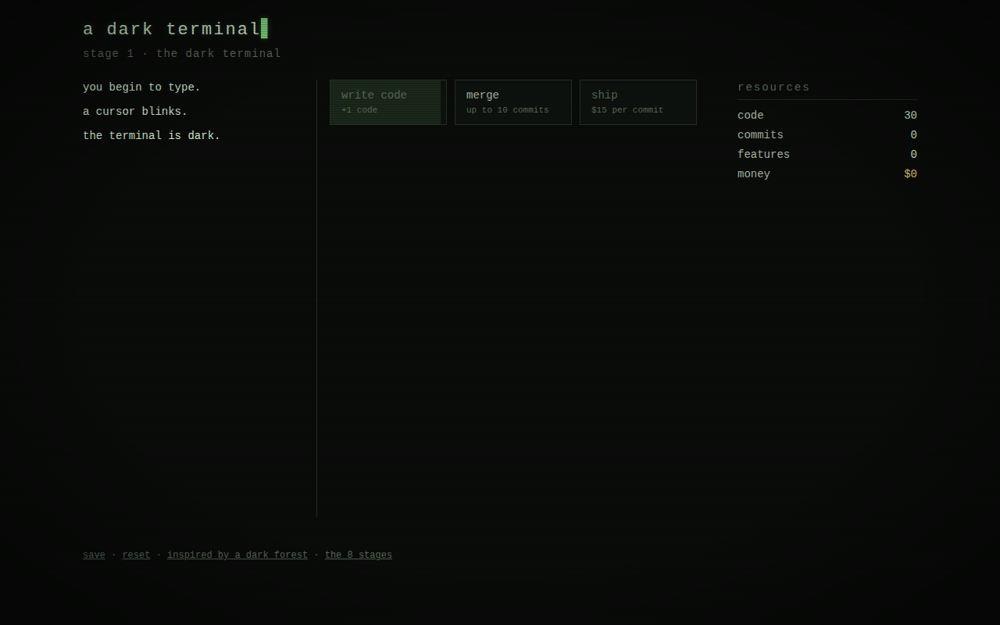
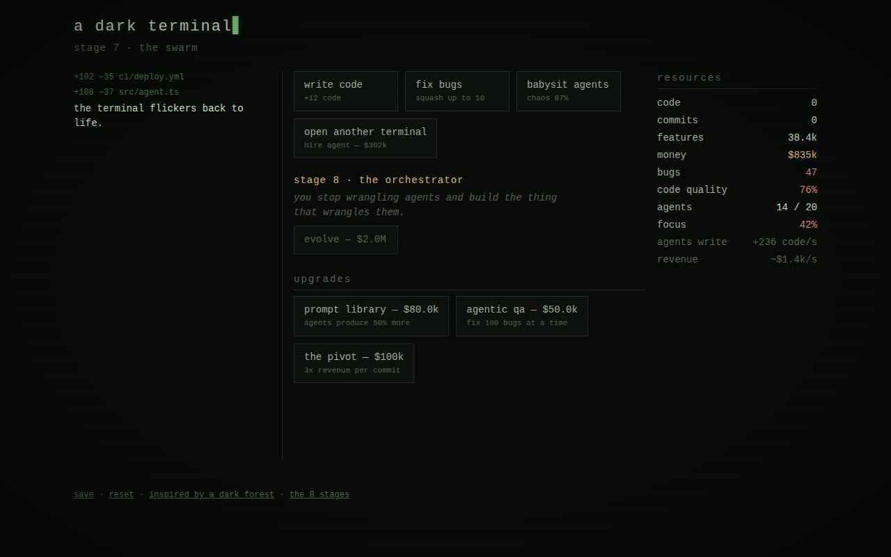

# a dark terminal

> the terminal is dark. a cursor blinks. you begin to type.

An incremental game about the evolution of a software developer through
[Steve Yegge's 8 stages of AI-assisted development](https://steve-yegge.medium.com/the-future-of-coding-agents-e9451a84207c),
inspired by the open-source Godot game
[A Dark Forest](https://github.com/TinyTakinTeller/GodotProjectZero)
(itself inspired by A Dark Room).

You start alone in a dark terminal, manually writing, merging, and shipping
code one click at a time. Then an agent wakes up in your IDE — and asks
permission for everything. Then you turn the permissions off. By the end,
you've built the thing that writes the thing.



## play

Open `index.html` in a browser. That's it — no build step, no dependencies.

Or serve it locally:

```sh
python3 -m http.server
# then open http://localhost:8000
```

Progress autosaves to `localStorage`. A full playthrough takes roughly
half an hour.

## the eight stages

| stage | name | what changes |
|---|---|---|
| 1 | the dark terminal | you write, merge, and ship by hand. tab completion feels like cheating. |
| 2 | an agent in the ide | an agent writes code, but asks permission for every change. allow. allow. allow. |
| 3 | yolo mode | you turn the guardrails off. code flows. bugs appear. |
| 4 | the wide agent | one agent, the whole codebase at once. merges happen on their own. |
| 5 | the cli | no more ide. diffs scroll by — you may or may not look at them. |
| 6 | parallel instances | three to five agents at once. you are very fast. |
| 7 | the swarm | ten or more agents, hand-managed. you spend more time herding than building. |
| 8 | the orchestrator | you stop wrangling agents and build the thing that wrangles them. |



## mechanics

- **code → commits → features → money.** Write code (10 lines = 1 commit),
  merge it, ship it, get paid.
- **agents** write code passively. At stage 2 their diffs pile up until you
  click *review diffs* to allow them; from stage 3 on the code flows freely —
  but unreviewed agent code carries **bugs**, which drag down code quality
  and your revenue. Code you write or review by hand never does.
- **chaos** sets in at stage 7: every agent past the fifth erodes your
  **focus**, and you'll be clicking *babysit agents* to keep the swarm
  productive. The only way out is to build the orchestrator.
- **upgrades** range from a mechanical keyboard to a prompt library to
  adding the word "agentic" to your landing page.

## development

The game is plain HTML/CSS/JS with no dependencies:

- `js/engine.js` — pure game logic (state, economy, ticks). Runs in the
  browser and in Node.
- `js/ui.js` — DOM rendering, the main loop, the event log, saves.
- `test/sim.js` — a headless bot that plays the entire game and asserts the
  economy is completable. Run it with `node test/sim.js`.

## credits

- [A Dark Forest](https://github.com/TinyTakinTeller/GodotProjectZero) by
  TinyTakinTeller and contributors — the inspiration for the tone, pacing,
  and minimalist log-driven presentation.
- [Steve Yegge](https://steve-yegge.medium.com/) — the 8 stages of
  AI-assisted development (and the chimp-wrangling).
- A Dark Room by Doublespeak Games — the genre's dark, quiet heart.

MIT licensed. See [LICENSE](LICENSE).
